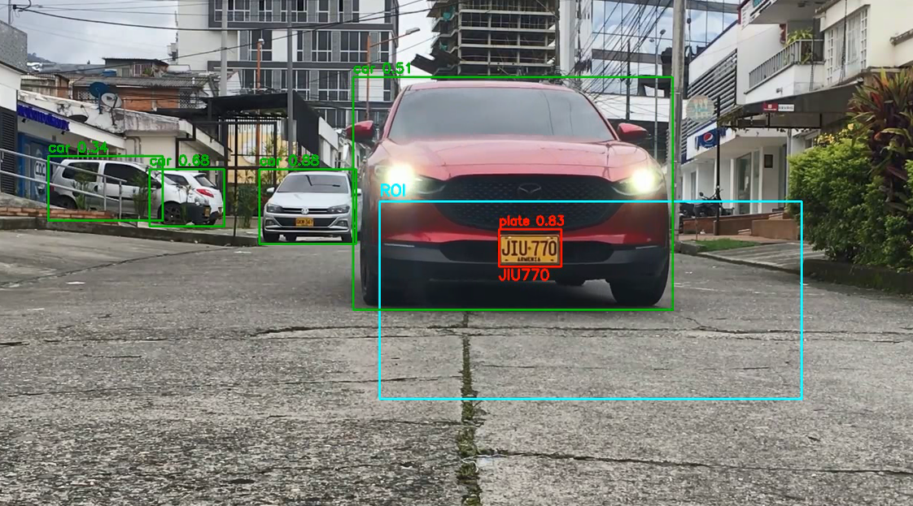

# 🚗 Vehicle & License Plate Detection with YOLO26

This project implements a vehicle and license plate detection pipeline using **YOLO26**, combined with structured filtering logic and optional OCR integration.

The system processes video input, detects vehicles and license plates, applies Region of Interest (ROI) filtering, and optionally runs OCR on high-confidence plate detections.

---

## Overview


## 🔍 Features

- Vehicle detection using YOLO26  
- License plate detection using YOLO26  
- ROI-based filtering  
- Optional constraint: plates must belong to detected vehicles  
- Confidence threshold filtering  
- Optional OCR applied only to high-confidence plates  
- FiftyOne experiment logging support  
- Annotated video output  

---

## 🧠 Detection Logic

License plates are validated only when:

- They exceed a configurable confidence threshold  
- They fall inside a defined ROI (if enabled)  
- They optionally belong to a detected vehicle  

OCR is executed only when the detection confidence surpasses a defined minimum value.

---

## 📦 Requirements

- Python 3.9+  
- OpenCV  
- NumPy  
- Ultralytics (YOLO)  
- FiftyOne (optional)  
- OCR dependencies (depending on your implementation)  

Install core dependencies:

```bash
pip install opencv-python numpy ultralytics fiftyone
```

How to run the code.

```bash
python main.py \
  --video input.mp4 \
  --plate-det-model your_plate_model.pt \
  --plates-in-cars-only \
  --use-roi --roi "0.25,0.40,0.75,1.0" \
  --ocr \
  --ocr-min-conf 0.75 \
  --show
```
⚙️ Key Arguments
---
| Argument                | Description                                |
| ----------------------- | ------------------------------------------ |
| `--video`               | Path to input video                        |
| `--car-seg-model`       | Vehicle detection model                    |
| `--plate-det-model`     | Plate detection model                      |
| `--plates-in-cars-only` | Detect plates only inside vehicles         |
| `--use-roi`             | Enable ROI filtering                       |
| `--roi`                 | ROI coordinates (normalized format)        |
| `--ocr`                 | Enable OCR                                 |
| `--ocr-min-conf`        | Minimum confidence required to trigger OCR |
| `--frame-skip`          | Frame inference interval                   |
| `--infer-scale`         | Resize factor for inference                |
| `--fo`                  | Enable FiftyOne logging                    |


🏗 Applications
---
This pipeline can be applied to:

- Toll systems
- Parking facilities
- Gated communities
- Traffic monitoring
- Access control systems
- Fleet management

Performance improves in controlled environments where vehicles briefly stop, enabling more reliable license plate reading.

📌 Notes
---
OCR accuracy depends on lighting, motion, plate size, and image quality.

📄 License
---
This project is intended for research and educational purposes.
